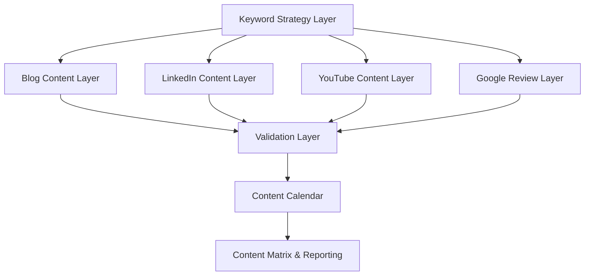
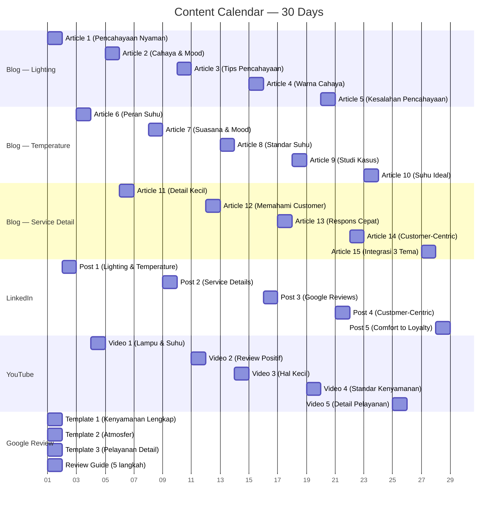
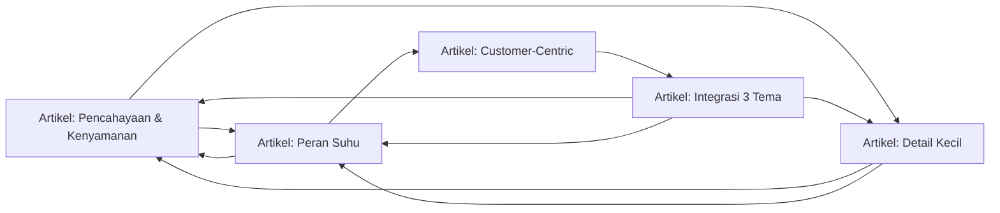

# Design Document

## Feature: SEO Customer Experience Content

---

## Overview

Fitur ini merancang sebuah **Content_System** yang berfungsi sebagai kerangka kerja terstruktur untuk merencanakan, memproduksi, memvalidasi, dan mendistribusikan konten SEO multi-platform. Fokus tematik adalah **customer experience** — khususnya kenyamanan ruangan (pencahayaan dan suhu) serta kualitas pelayanan detail — yang didistribusikan ke empat platform: Website/Blog, LinkedIn, YouTube, dan Google Review.

Sistem ini bukan merupakan aplikasi software berbasis database, melainkan sebuah **content framework** yang terdiri dari:

- Struktur dan template konten per platform
- Panduan strategi SEO (keyword targeting, meta tag, internal linking)
- Kalender konten 30 hari
- Matriks koordinasi lintas platform
- Aturan validasi konten yang dapat diotomatisasi

Tujuan akhirnya adalah meningkatkan visibilitas pencarian organik, mendorong Google Review positif, dan membangun otoritas bisnis di seluruh platform digital.

---

## Architecture

Arsitektur Content_System dirancang sebagai lapisan-lapisan yang saling mendukung:



### Layer Descriptions

| Layer | Fungsi |
|---|---|
| **Keyword Strategy Layer** | Mendefinisikan semua Kata_Kunci_Utama, dikelompokkan berdasarkan search intent (informational, navigational, transactional) |
| **Blog Content Layer** | Menghasilkan artikel panjang (1.000–1.600 kata) dengan struktur heading H1/H2/H3, meta tag, internal link, dan CTA |
| **LinkedIn Content Layer** | Menghasilkan postingan profesional dengan hook, hashtag, dan data pendukung |
| **YouTube Content Layer** | Menghasilkan judul ≤70 karakter dan deskripsi terstruktur dengan kata kunci |
| **Google Review Layer** | Menghasilkan template review, panduan langkah, pertanyaan pemandu, dan strategi timing |
| **Validation Layer** | Memverifikasi bahwa setiap konten memenuhi constraint yang ditetapkan (panjang karakter, kehadiran meta tag, internal link, dll.) |
| **Content Calendar** | Menjadwalkan publikasi semua konten selama 30 hari ke depan |
| **Content Matrix & Reporting** | Merangkum semua konten: topik, platform, kata kunci, status publikasi |

---

## Components and Interfaces

### 1. Keyword Strategy Component

Komponen ini mendefinisikan semua kata kunci target dan mengelompokkannya berdasarkan intent.

**Interface:**

```
KeywordGroup {
  intent: "informational" | "navigational" | "transactional"
  keywords: string[]   // min 10 kata kunci di seluruh kelompok
  platforms: Platform[]
}

Platform = "blog" | "linkedin" | "youtube" | "google_review"
```

**Kata Kunci Utama (≥10):**

| # | Kata Kunci | Intent | Platform |
|---|---|---|---|
| 1 | kenyamanan ruangan | informational | blog, linkedin, youtube |
| 2 | pencahayaan customer experience | informational | blog, youtube |
| 3 | suhu ruangan customer satisfaction | informational | blog, youtube |
| 4 | pelayanan responsif | informational | blog, linkedin |
| 5 | customer experience | informational | blog, linkedin, youtube |
| 6 | meningkatkan Google Review | transactional | blog, linkedin, youtube, google_review |
| 7 | tips pelayanan pelanggan | informational | blog, linkedin |
| 8 | customer-centric service | informational | linkedin |
| 9 | cara meningkatkan kepuasan pelanggan | informational | blog, youtube |
| 10 | detail pelayanan loyalitas customer | informational | blog, linkedin |
| 11 | rating bisnis Google | transactional | google_review, blog |
| 12 | jasa layanan kenyamanan ruangan | navigational | blog, google_review |

---

### 2. Blog Content Component

Mengelola produksi artikel blog untuk tiga kelompok topik: pencahayaan, suhu ruangan, dan detail pelayanan.

**Interface:**

```
BlogArticle {
  id: string
  title: string
  group: "lighting" | "temperature" | "service_detail"
  primaryKeyword: string
  headings: {
    h1: string        // mengandung primaryKeyword
    h2: string[]
    h3: string[]
  }
  metaTag: MetaTag
  wordCountRange: [1000, 1600]
  internalLinks: InternalLink[]  // min 2
  callToAction: string
  hasStudyCase: boolean          // required untuk group "temperature"
  hasPracticalTips: boolean      // required untuk group "service_detail"
}

MetaTag {
  titleTag: string    // max 60 karakter
  metaDescription: string  // 150–160 karakter
}

InternalLink {
  anchorText: string
  targetArticleId: string
}
```

**Judul Artikel Blog (15 total — 5 per kelompok):**

**Kelompok A: Pencahayaan & Kenyamanan (Req 1)**
1. "Mengapa Pencahayaan yang Tepat Membuat Customer Lebih Nyaman dan Betah"
2. "Hubungan Antara Cahaya dan Mood: Fakta yang Perlu Diketahui Pebisnis"
3. "Tips Memilih Pencahayaan Ruangan untuk Meningkatkan Customer Experience"
4. "Pengaruh Warna Cahaya terhadap Persepsi Kualitas Layanan"
5. "Kesalahan Pencahayaan yang Tanpa Sadar Menurunkan Kepuasan Customer"

**Kelompok B: Suhu Ruangan & Customer Satisfaction (Req 2)**
1. "Peran Suhu Ruangan dalam Menciptakan Pengalaman Customer yang Nyaman"
2. "Bagaimana Suasana Ruangan Memengaruhi Mood dan Keputusan Customer"
3. "Standar Suhu Ruangan yang Direkomendasikan untuk Layanan Pelanggan"
4. "Studi Kasus: Bisnis yang Meningkatkan Rating Setelah Memperbaiki Suhu Ruangan"
5. "Suhu Ideal vs Suhu Aktual: Cara Mengukur Kenyamanan Termal Customer"

**Kelompok C: Detail Pelayanan & Loyalitas (Req 3)**
1. "Detail Kecil yang Membuat Customer Merasa Diperhatikan dan Ingin Kembali"
2. "Cara Memahami Keinginan Customer Melalui Pelayanan yang Responsif"
3. "Mengapa Customer Lebih Puas Saat Kebutuhannya Direspons dengan Cepat"
4. "Customer-Centric Service: Strategi Melayani yang Berpusat pada Pelanggan"
5. "Integrasi Pencahayaan, Suhu, dan Pelayanan: Formula Kepuasan Customer"

---

### 3. LinkedIn Content Component

Mengelola produksi postingan LinkedIn profesional dengan target audiens B2B.

**Interface:**

```
LinkedInPost {
  id: string
  titleEN: string         // judul utama dalam Bahasa Inggris
  bodyLanguage: "EN" | "ID" | "bilingual"
  hook: string            // kalimat pembuka ≤2 baris, memancing engagement
  body: string
  hashtags: string[]      // 3–5 hashtag
  hasDataOrStat: boolean  // min 1 fakta/angka
  targetAudience: "B2B" | "professional"
}
```

**Topik LinkedIn (5 postingan):**

1. "The Role of Lighting and Room Temperature in Customer Experience"
2. "How Small Service Details Improve Customer Satisfaction and Online Reviews"
3. "Why Businesses That Prioritize Customer Comfort Get More Google Reviews"
4. "Customer-Centric Service: The Competitive Edge You're Not Leveraging"
5. "From Comfort to Loyalty: The Science of Room Environment in Business"

---

### 4. YouTube Content Component

Mengelola judul dan deskripsi video YouTube yang dioptimasi untuk SEO dan watch-time.

**Interface:**

```
YouTubeContent {
  id: string
  title: string          // max 70 karakter
  primaryKeyword: string
  description: YouTubeDescription
  tags: string[]         // 5–10 tag
  titleIsQuestion: boolean
  questionAnsweredWithin60s: boolean  // required jika titleIsQuestion = true
}

YouTubeDescription {
  openingParagraph: string  // 2–3 kalimat dengan primaryKeyword
  bulletPoints: string[]    // poin-poin yang dibahas
  callToAction: string      // ajakan like dan subscribe
  blogLinks: string[]       // link ke artikel blog terkait
}
```

**Judul YouTube (5 video):**

1. "Kenapa Lampu dan Suhu Ruangan Bisa Bikin Customer Lebih Nyaman?" *(62 karakter)*
2. "Cara Meningkatkan Review Positif dari Pengalaman Customer" *(56 karakter)*
3. "Hal Kecil yang Bikin Customer Betah dan Puas" *(45 karakter)*
4. "Standar Kenyamanan Ruangan yang Bisnis Sukses Terapkan" *(54 karakter)*
5. "Detail Pelayanan yang Bikin Customer Mau Balik Lagi" *(51 karakter)*

---

### 5. Google Review Component

Mengelola template review, panduan, pertanyaan pemandu, dan strategi timing.

**Interface:**

```
ReviewTemplate {
  id: string
  text: string
  mentionsLighting: boolean    // MUST be true
  mentionsTemperature: boolean // MUST be true
  mentionsService: boolean     // MUST be true
  isAuthentic: boolean
  language: "ID"
}

ReviewGuide {
  steps: string[]      // min 5 langkah
  language: "ID"
  promptingQuestions: string[]  // pertanyaan pemandu
  timingStrategy: TimingStrategy
}

TimingStrategy {
  bestMoments: string[]  // kapan waktu terbaik meminta review
  channelSuggestions: string[]
}
```

**3 Template Review:**

**Template 1 — Kenyamanan Lengkap:**
> "Saya sangat puas dengan pelayanan di sini! Pencahayaannya nyaman di mata, suhu ruangannya pas — tidak terlalu dingin atau panas. Stafnya juga sangat responsif dan memperhatikan kebutuhan kami dengan detail. Pengalaman yang benar-benar menyenangkan. Highly recommended!"

**Template 2 — Fokus Atmosfer:**
> "Tempat ini benar-benar memahami kenyamanan pelanggan. Lighting-nya menciptakan suasana yang hangat, AC-nya diatur dengan sempurna, dan pelayanannya sigap merespons setiap permintaan. Saya pasti akan kembali lagi."

**Template 3 — Fokus Pelayanan Detail:**
> "Yang membuat pengalaman di sini berbeda adalah perhatian terhadap detail kecil: cahaya yang tidak menyilaukan, ruangan yang sejuk, dan staf yang tanggap. Mulai dari hal terkecil, semuanya diperhatikan. Rating bintang 5 sangat layak!"

---

### 6. Validation Component

Memverifikasi setiap konten yang diproduksi memenuhi semua constraint.

**Validation Rules:**

```
BlogValidation {
  titleTagMaxChars: 60
  metaDescriptionRange: [150, 160]
  internalLinksMin: 2
  wordCountRange: [1000, 1600]
  h1ContainsKeyword: true
  hasCallToAction: true
}

YouTubeValidation {
  titleMaxChars: 70
  tagsRange: [5, 10]
  descriptionHasOpeningParagraph: true
  descriptionHasBulletPoints: true
  descriptionHasCallToAction: true
  descriptionHasBlogLinks: true
}

ReviewValidation {
  mentionsAllThreeComfortAspects: true  // lighting + temperature + service
  isAuthentic: true
  guideStepsMin: 5
}

LinkedInValidation {
  hasHook: true
  hashtagsRange: [3, 5]
  hasDataOrStat: true
}

KeywordValidation {
  totalKeywordsMin: 10
  hasInformational: true
  hasNavigational: true
  hasTransactional: true
}
```

---

### 7. Content Calendar Component

Menjadwalkan publikasi konten selama 30 hari.

**Interface:**

```
ContentCalendar {
  entries: CalendarEntry[]
  durationDays: 30  // minimum
}

CalendarEntry {
  day: number
  platform: Platform
  contentId: string
  contentTitle: string
  primaryKeyword: string
  status: "scheduled" | "published" | "draft"
}
```

---

### 8. Content Matrix Component

Ringkasan matriks yang dihasilkan setelah semua konten diproduksi.

**Interface:**

```
ContentMatrix {
  rows: ContentMatrixRow[]
}

ContentMatrixRow {
  topic: string
  platform: Platform
  primaryKeyword: string
  status: "draft" | "published" | "scheduled"
  engagementStatus: "normal" | "high_engagement_detected"
}
```

---

## Data Models

### ContentItem (Base Model)

```typescript
interface ContentItem {
  id: string;
  platform: "blog" | "linkedin" | "youtube" | "google_review";
  title: string;
  primaryKeyword: string;
  status: "draft" | "scheduled" | "published";
  createdAt: string; // ISO date
  publishedAt?: string;
}
```

### BlogArticle extends ContentItem

```typescript
interface BlogArticle extends ContentItem {
  platform: "blog";
  group: "lighting" | "temperature" | "service_detail";
  titleTag: string;       // max 60 chars
  metaDescription: string; // 150–160 chars
  h1: string;              // contains primaryKeyword
  h2Headings: string[];
  wordCount: number;       // 1000–1600
  internalLinks: { anchorText: string; targetId: string }[]; // min 2
  callToAction: string;
  hasStudyCase: boolean;
  hasPracticalTips: boolean;
}
```

### LinkedInPost extends ContentItem

```typescript
interface LinkedInPost extends ContentItem {
  platform: "linkedin";
  titleEN: string;
  hook: string;            // ≤2 lines
  body: string;
  hashtags: string[];      // 3–5
  hasSupportingData: boolean;
}
```

### YouTubeContent extends ContentItem

```typescript
interface YouTubeContent extends ContentItem {
  platform: "youtube";
  titleLength: number;     // max 70
  descriptionOpening: string;
  bulletPoints: string[];
  callToAction: string;
  blogLinks: string[];
  tags: string[];          // 5–10
  isTitleQuestion: boolean;
}
```

### ReviewTemplate extends ContentItem

```typescript
interface ReviewTemplate extends ContentItem {
  platform: "google_review";
  text: string;
  mentionsLighting: boolean;    // must be true
  mentionsTemperature: boolean; // must be true
  mentionsService: boolean;     // must be true
}
```

### Keyword

```typescript
interface Keyword {
  phrase: string;
  intent: "informational" | "navigational" | "transactional";
  platforms: ContentItem["platform"][];
}
```

### CalendarEntry

```typescript
interface CalendarEntry {
  day: number;              // 1–30+
  platform: ContentItem["platform"];
  contentId: string;
  contentTitle: string;
  primaryKeyword: string;
  status: "scheduled" | "published" | "draft";
}
```

### ContentMatrixRow

```typescript
interface ContentMatrixRow {
  topic: string;
  platform: ContentItem["platform"];
  primaryKeyword: string;
  status: ContentItem["status"];
  engagementStatus: "normal" | "high_engagement_detected";
}
```

---

## Content Calendar (30-Day Schedule)



---

## SEO Internal Linking Map

Setiap artikel blog harus memiliki minimal 2 internal link. Peta linking yang direkomendasikan:



**Panduan Internal Linking:**
- Artikel dalam kelompok yang sama HARUS saling link (cluster linking)
- Artikel Kelompok C (Service Detail) berfungsi sebagai **pillar content** dan menerima link dari kelompok A dan B
- Gunakan anchor text yang mengandung kata kunci target (bukan "klik di sini")
- Hindari circular linking lebih dari 2 tingkat

---

## Correctness Properties

*A property is a characteristic or behavior that should hold true across all valid executions of a system — essentially, a formal statement about what the system should do. Properties serve as the bridge between human-readable specifications and machine-verifiable correctness guarantees.*

---

### Property 1: Blog Article Group Coverage

*For any* valid content set, each of the three blog article groups (lighting, temperature, service_detail) must contain at least 5 articles.

**Validates: Requirements 1.1, 2.1, 3.1**

---

### Property 2: Blog Meta Tag Validity

*For any* BlogArticle, the `titleTag` must be at most 60 characters long, and the `metaDescription` must be between 150 and 160 characters (inclusive).

**Validates: Requirements 1.2, 2.4**

---

### Property 3: H1 Contains Primary Keyword

*For any* BlogArticle, the `h1` heading must be non-empty and must contain the article's `primaryKeyword` as a natural substring.

**Validates: Requirements 1.3**

---

### Property 4: Blog CTA Presence

*For any* published BlogArticle, the `callToAction` field must be a non-empty string directing readers to leave a Google Review.

**Validates: Requirements 1.5**

---

### Property 5: Minimum Internal Links

*For any* BlogArticle, the `internalLinks` array must contain at least 2 entries.

**Validates: Requirements 1.6**

---

### Property 6: Word Count Range

*For any* BlogArticle, the `wordCount` must be in the range [1000, 1600] inclusive.

**Validates: Requirements 3.4**

---

### Property 7: Temperature Articles Include Study Case

*For any* BlogArticle where `group = "temperature"`, the `hasStudyCase` field must be `true`.

**Validates: Requirements 2.5**

---

### Property 8: Service Detail Articles Include Practical Tips

*For any* BlogArticle where `group = "service_detail"`, the `hasPracticalTips` field must be `true`.

**Validates: Requirements 3.5**

---

### Property 9: LinkedIn Post Structural Completeness

*For any* LinkedInPost, the following must all hold: `hook` is non-empty, `hashtags.length` is between 3 and 5 (inclusive), and `hasSupportingData` is `true`.

**Validates: Requirements 4.4, 4.5, 4.6**

---

### Property 10: LinkedIn Platform Coverage

*For any* valid content set, the number of LinkedIn posts must be at least 5.

**Validates: Requirements 4.1**

---

### Property 11: YouTube Title Length

*For any* YouTubeContent, the `title` must not exceed 70 characters.

**Validates: Requirements 5.2**

---

### Property 12: YouTube Content Structural Completeness

*For any* YouTubeContent, all of the following must hold: `descriptionOpening` is non-empty, `bulletPoints` has at least 1 entry, `callToAction` is non-empty, `blogLinks` has at least 1 entry, and `tags.length` is between 5 and 10 (inclusive).

**Validates: Requirements 5.4, 5.5**

---

### Property 13: Question Title Answered Within 60 Seconds

*For any* YouTubeContent where `isTitleQuestion = true`, the `questionAnsweredWithin60s` field must be `true`.

**Validates: Requirements 5.6**

---

### Property 14: YouTube Platform Coverage

*For any* valid content set, the number of YouTube content items must be at least 5.

**Validates: Requirements 5.1**

---

### Property 15: Review Template Mentions All Three Comfort Aspects

*For any* ReviewTemplate, all three comfort aspect flags must be `true`: `mentionsLighting`, `mentionsTemperature`, and `mentionsService`.

**Validates: Requirements 6.2**

---

### Property 16: Review Template Authenticity

*For any* ReviewTemplate, the `isAuthentic` field must be `true`.

**Validates: Requirements 6.7**

---

### Property 17: Minimum Three Review Templates

*For any* valid content set, the number of ReviewTemplate items must be at least 3.

**Validates: Requirements 6.1**

---

### Property 18: Review Guide Steps and Prompting Questions

*For any* ReviewGuide, the `steps` array must contain at least 5 entries, and the `promptingQuestions` array must be non-empty.

**Validates: Requirements 6.3, 6.5**

---

### Property 19: Review Guide Timing Strategy

*For any* ReviewGuide, the `timingStrategy.bestMoments` array must be non-empty.

**Validates: Requirements 6.6**

---

### Property 20: Keyword Set Coverage (Count and Intent)

*For any* valid keyword set, the total number of keywords must be at least 10, and the set must include at least one keyword for each intent type: `informational`, `navigational`, and `transactional`.

**Validates: Requirements 7.1, 7.2**

---

### Property 21: Content Calendar Platform and Duration Coverage

*For any* ContentCalendar, the entries must include content for all four platforms (`blog`, `linkedin`, `youtube`, `google_review`), and the calendar must span at least 30 days (`max(day) - min(day) >= 29`).

**Validates: Requirements 7.3**

---

### Property 22: High-Engagement Topic Cross-Platform Propagation

*For any* ContentMatrixRow where `engagementStatus = "high_engagement_detected"`, the topic of that row must appear in at least one additional ContentMatrixRow targeting a different platform.

**Validates: Requirements 7.5**

---

### Property 23: Content Matrix Row Completeness

*For any* ContentMatrixRow in the content matrix output, the fields `topic`, `platform`, `primaryKeyword`, and `status` must all be non-empty and defined.

**Validates: Requirements 7.7**

---

## Error Handling

### Validation Errors

Setiap kali proses produksi konten menghasilkan item yang tidak memenuhi constraint, sistem harus mendeteksi dan melaporkan error dengan jelas sebelum konten dipublikasikan.

| Error Type | Trigger | Action |
|---|---|---|
| `META_TAG_TITLE_TOO_LONG` | titleTag > 60 karakter | Flagged; editor harus mempersingkat sebelum publish |
| `META_DESCRIPTION_OUT_OF_RANGE` | metaDescription < 150 atau > 160 karakter | Flagged; editor menyesuaikan panjang |
| `MISSING_H1_KEYWORD` | h1 tidak mengandung primaryKeyword | Flagged; h1 harus direvisi |
| `INSUFFICIENT_INTERNAL_LINKS` | internalLinks.length < 2 | Sistem menambahkan link yang direkomendasikan dari linking map |
| `WORD_COUNT_VIOLATION` | wordCount < 1000 atau > 1600 | Flagged untuk editing |
| `MISSING_CTA` | callToAction kosong | Flagged; CTA standar disarankan |
| `YOUTUBE_TITLE_TOO_LONG` | title.length > 70 | Flagged; editor mempersingkat |
| `YOUTUBE_TAG_COUNT_VIOLATION` | tags.length < 5 atau > 10 | Flagged |
| `LINKEDIN_HASHTAG_VIOLATION` | hashtags.length < 3 atau > 5 | Flagged |
| `REVIEW_MISSING_COMFORT_ASPECT` | mentionsLighting, mentionsTemperature, atau mentionsService = false | Error kritis; template tidak boleh dipublikasikan |
| `REVIEW_NOT_AUTHENTIC` | isAuthentic = false | Error kritis; template tidak boleh dipublikasikan |
| `KEYWORD_INTENT_INCOMPLETE` | Tidak ada keyword untuk salah satu intent type | Error kritis pada strategi keyword |

### Handling untuk High Engagement

Ketika `engagementStatus = "high_engagement_detected"` dideteksi, sistem menghasilkan rekomendasi otomatis (bukan blocking error):

```
EngagementRecommendation {
  sourceContentId: string
  sourcePlatform: Platform
  sourceTopic: string
  recommendedPlatforms: Platform[]
  suggestedFormats: string[]
}
```

---

## Testing Strategy

### Assessment: Apakah PBT Berlaku?

Fitur ini adalah **content management framework** — bukan infrastruktur cloud atau murni UI rendering. Komponen utamanya adalah fungsi-fungsi validasi yang menerima content objects sebagai input dan memverifikasi constraint. Fungsi validasi ini adalah **pure functions** dengan input/output yang jelas, sehingga **property-based testing SANGAT SESUAI** untuk fitur ini.

### Library Property-Based Testing

Karena proyek ini menggunakan TypeScript, library yang direkomendasikan adalah **[fast-check](https://github.com/dubzzz/fast-check)**.

```bash
npm install --save-dev fast-check
```

### Dual Testing Approach

#### Unit Tests (Jest + TypeScript)

Digunakan untuk:
- Verifikasi coverage tema yang spesifik (Requirements 1.4, 2.3, 3.2, 4.3, 5.3)
- Verifikasi bahasa yang digunakan dalam konten
- Verifikasi bahwa artikel integrasi mencakup ketiga tema
- Edge cases: artikel dengan wordCount tepat di batas (1000 dan 1600), title tag tepat 60 karakter

#### Property Tests (fast-check, minimum 100 iterasi)

Setiap property test harus:
- Dijalankan minimum **100 iterasi** (default fast-check: 100)
- Diberi komentar referensi ke property design dokumen dengan format:
  `// Feature: seo-customer-experience-content, Property N: <property_text>`

**Contoh implementasi property test:**

```typescript
import fc from 'fast-check';
import { validateBlogArticle } from '../validators/blog-validator';
import { arbitraryBlogArticle } from '../generators/blog-article';

// Feature: seo-customer-experience-content, Property 2: Blog Meta Tag Validity
test('Property 2: Blog meta tag must have valid title (≤60 chars) and description (150–160 chars)', () => {
  fc.assert(
    fc.property(arbitraryBlogArticle(), (article) => {
      const result = validateBlogArticle(article);
      expect(result.titleTag.length).toBeLessThanOrEqual(60);
      expect(result.metaDescription.length).toBeGreaterThanOrEqual(150);
      expect(result.metaDescription.length).toBeLessThanOrEqual(160);
    }),
    { numRuns: 100 }
  );
});

// Feature: seo-customer-experience-content, Property 15: Review Template Mentions All Three Comfort Aspects
test('Property 15: Every review template must mention lighting, temperature, and service', () => {
  fc.assert(
    fc.property(arbitraryReviewTemplate(), (template) => {
      expect(template.mentionsLighting).toBe(true);
      expect(template.mentionsTemperature).toBe(true);
      expect(template.mentionsService).toBe(true);
    }),
    { numRuns: 100 }
  );
});
```

### Test Coverage Map

| Property | Test Type | Requirement |
|---|---|---|
| 1 — Blog Group Coverage | Property | 1.1, 2.1, 3.1 |
| 2 — Blog Meta Tag Validity | Property | 1.2, 2.4 |
| 3 — H1 Contains Keyword | Property | 1.3 |
| 4 — Blog CTA Presence | Property | 1.5 |
| 5 — Minimum Internal Links | Property | 1.6 |
| 6 — Word Count Range | Property | 3.4 |
| 7 — Temperature Study Case | Property | 2.5 |
| 8 — Service Practical Tips | Property | 3.5 |
| 9 — LinkedIn Structural Completeness | Property | 4.4, 4.5, 4.6 |
| 10 — LinkedIn Coverage | Property | 4.1 |
| 11 — YouTube Title Length | Property | 5.2 |
| 12 — YouTube Description Completeness | Property | 5.4, 5.5 |
| 13 — Question Answered in 60s | Property | 5.6 |
| 14 — YouTube Coverage | Property | 5.1 |
| 15 — Review Mentions All 3 Aspects | Property | 6.2 |
| 16 — Review Authenticity | Property | 6.7 |
| 17 — Min 3 Review Templates | Property | 6.1 |
| 18 — Review Guide Steps & Questions | Property | 6.3, 6.5 |
| 19 — Timing Strategy Non-Empty | Property | 6.6 |
| 20 — Keyword Count and Intent | Property | 7.1, 7.2 |
| 21 — Calendar Platform & Duration | Property | 7.3 |
| 22 — High Engagement Propagation | Property | 7.5 |
| 23 — Matrix Row Completeness | Property | 7.7 |
| Theme coverage (Req 1.4, 2.3, 3.2, 4.3, 5.3) | Unit (Example) | Various |
| Language checks (Req 4.2, 6.4) | Unit (Example) | 4.2, 6.4 |
| Internal linking guide existence (Req 7.6) | Smoke | 7.6 |

### Generators (fast-check Arbitraries)

```typescript
// arbitraryBlogArticle: generates random BlogArticle respecting constraints
const arbitraryBlogArticle = () => fc.record({
  id: fc.uuid(),
  platform: fc.constant('blog'),
  group: fc.constantFrom('lighting', 'temperature', 'service_detail'),
  primaryKeyword: fc.constantFrom(ALL_KEYWORDS),
  titleTag: fc.string({ maxLength: 60 }),
  metaDescription: fc.string({ minLength: 150, maxLength: 160 }),
  h1: fc.string({ minLength: 1 }).map(s => `${s} ${randomKeyword()}`),
  wordCount: fc.integer({ min: 1000, max: 1600 }),
  internalLinks: fc.array(fc.record({
    anchorText: fc.string({ minLength: 1 }),
    targetId: fc.uuid()
  }), { minLength: 2 }),
  callToAction: fc.string({ minLength: 10 }),
  hasStudyCase: fc.boolean(),
  hasPracticalTips: fc.boolean(),
  status: fc.constantFrom('draft', 'scheduled', 'published'),
});
```

---
