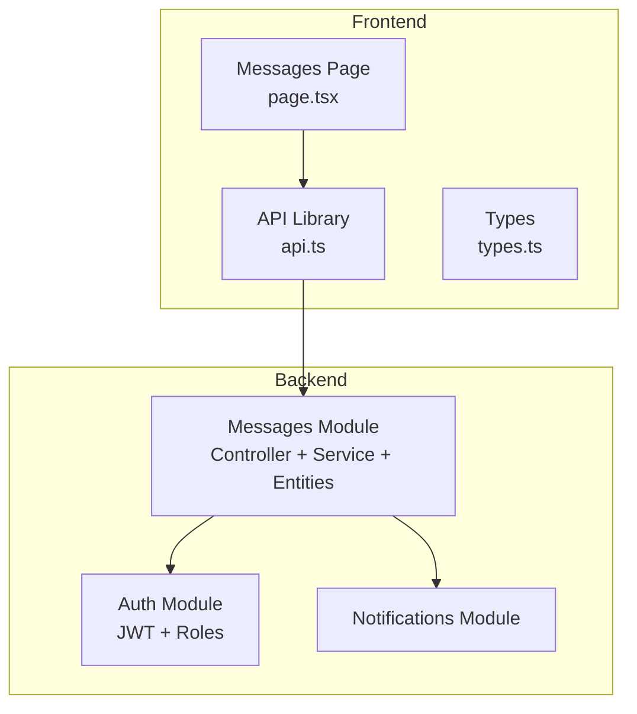
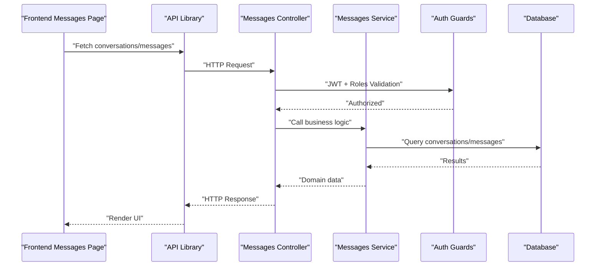
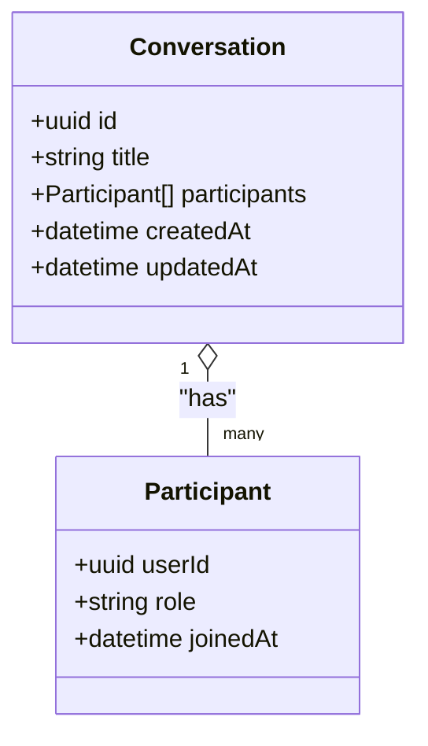
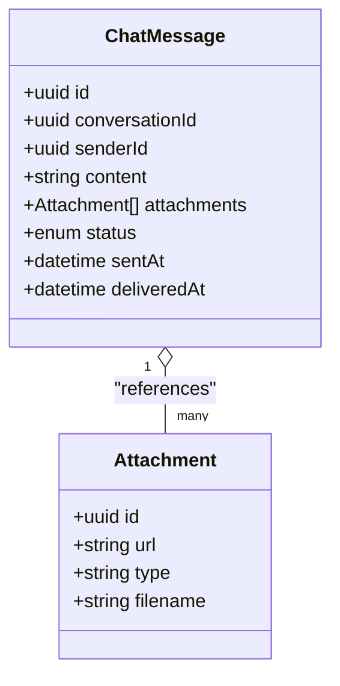

# Real-Time Messaging & Conversations

<cite>
**Referenced Files in This Document**
- [conversation.entity.ts](file://app/backend/src/modules/messages/entities/conversation.entity.ts)
- [chat-message.entity.ts](file://app/backend/src/modules/messages/entities/chat-message.entity.ts)
- [messages.controller.ts](file://app/backend/src/modules/messages/messages.controller.ts)
- [messages.service.ts](file://app/backend/src/modules/messages/messages.service.ts)
- [auth.service.ts](file://app/backend/src/modules/auth/auth.service.ts)
- [jwt-auth.guard.ts](file://app/backend/src/modules/auth/guards/jwt-auth.guard.ts)
- [roles.guard.ts](file://app/backend/src/modules/auth/guards/roles.guard.ts)
- [roles.decorator.ts](file://app/backend/src/modules/auth/decorators/roles.decorator.ts)
- [user.entity.ts](file://app/backend/src/modules/auth/entities/user.entity.ts)
- [page.tsx](file://app/frontend/src/app/messages/page.tsx)
- [api.ts](file://app/frontend/src/lib/api.ts)
- [types.ts](file://app/frontend/src/lib/types.ts)
</cite>

## Table of Contents
1. [Introduction](#introduction)
2. [Project Structure](#project-structure)
3. [Core Components](#core-components)
4. [Architecture Overview](#architecture-overview)
5. [Detailed Component Analysis](#detailed-component-analysis)
6. [Dependency Analysis](#dependency-analysis)
7. [Performance Considerations](#performance-considerations)
8. [Security Considerations](#security-considerations)
9. [Frontend Integration Patterns](#frontend-integration-patterns)
10. [Troubleshooting Guide](#troubleshooting-guide)
11. [Conclusion](#conclusion)

## Introduction
This document describes the real-time messaging and conversation management system implemented in the project. It covers WebSocket-based instant message delivery, conversation threading with participant management, chat message processing and storage architecture, and message routing between different user roles. It also documents the conversation and chat message entity structures, frontend integration patterns for real-time updates, and security considerations including access control and privacy settings.

## Project Structure
The messaging system spans both backend NestJS modules and frontend Next.js pages/components:
- Backend modules: Authentication, Messages (controller, service, entities), Notifications
- Frontend pages: Messages page and supporting libraries for API communication and type definitions



**Diagram sources**
- [messages.controller.ts](file://app/backend/src/modules/messages/messages.controller.ts)
- [messages.service.ts](file://app/backend/src/modules/messages/messages.service.ts)
- [auth.service.ts](file://app/backend/src/modules/auth/auth.service.ts)
- [page.tsx](file://app/frontend/src/app/messages/page.tsx)
- [api.ts](file://app/frontend/src/lib/api.ts)
- [types.ts](file://app/frontend/src/lib/types.ts)

**Section sources**
- [messages.controller.ts](file://app/backend/src/modules/messages/messages.controller.ts)
- [messages.service.ts](file://app/backend/src/modules/messages/messages.service.ts)
- [page.tsx](file://app/frontend/src/app/messages/page.tsx)

## Core Components
- Conversation entity: Defines conversation metadata, participants, timestamps, and ordering.
- ChatMessage entity: Stores message content, attachments, sender, timestamps, and delivery status.
- Messages controller: Exposes endpoints for retrieving conversations and messages, and handles message creation.
- Messages service: Implements business logic for conversation retrieval, message persistence, and participant validation.
- Authentication and authorization: JWT guard and role-based access control for secure endpoints.
- Frontend messages page: Renders conversation lists, message composition, and integrates with backend APIs.

**Section sources**
- [conversation.entity.ts](file://app/backend/src/modules/messages/entities/conversation.entity.ts)
- [chat-message.entity.ts](file://app/backend/src/modules/messages/entities/chat-message.entity.ts)
- [messages.controller.ts](file://app/backend/src/modules/messages/messages.controller.ts)
- [messages.service.ts](file://app/backend/src/modules/messages/messages.service.ts)
- [jwt-auth.guard.ts](file://app/backend/src/modules/auth/guards/jwt-auth.guard.ts)
- [roles.guard.ts](file://app/backend/src/modules/auth/guards/roles.guard.ts)
- [roles.decorator.ts](file://app/backend/src/modules/auth/decorators/roles.decorator.ts)
- [page.tsx](file://app/frontend/src/app/messages/page.tsx)

## Architecture Overview
The system follows a layered architecture:
- Frontend Next.js page communicates with backend via REST endpoints.
- Backend controller validates requests and delegates to service.
- Service coordinates with repositories and domain logic.
- Entities define the data model persisted in the database.
- Authentication middleware enforces JWT and role-based access control.



**Diagram sources**
- [messages.controller.ts](file://app/backend/src/modules/messages/messages.controller.ts)
- [messages.service.ts](file://app/backend/src/modules/messages/messages.service.ts)
- [jwt-auth.guard.ts](file://app/backend/src/modules/auth/guards/jwt-auth.guard.ts)
- [roles.guard.ts](file://app/backend/src/modules/auth/guards/roles.guard.ts)
- [page.tsx](file://app/frontend/src/app/messages/page.tsx)
- [api.ts](file://app/frontend/src/lib/api.ts)

## Detailed Component Analysis

### Conversation Entity
The conversation entity encapsulates:
- Unique identifier and metadata
- Participants list with roles
- Timestamps for creation/update
- Ordering mechanism for message retrieval



**Diagram sources**
- [conversation.entity.ts](file://app/backend/src/modules/messages/entities/conversation.entity.ts)

**Section sources**
- [conversation.entity.ts](file://app/backend/src/modules/messages/entities/conversation.entity.ts)

### Chat Message Entity
The chat message entity captures:
- Content validation rules
- Optional attachments
- Sender identification
- Delivery status tracking
- Timestamps for ordering



**Diagram sources**
- [chat-message.entity.ts](file://app/backend/src/modules/messages/entities/chat-message.entity.ts)

**Section sources**
- [chat-message.entity.ts](file://app/backend/src/modules/messages/entities/chat-message.entity.ts)

### Messages Controller
Responsibilities:
- Expose endpoints for:
  - Listing conversations for a user
  - Retrieving messages in a conversation
  - Creating new messages
- Apply authentication and authorization guards
- Delegate to service for business logic

Key behaviors:
- Validates incoming DTOs
- Enforces access control per conversation
- Returns structured responses for frontend consumption

**Section sources**
- [messages.controller.ts](file://app/backend/src/modules/messages/messages.controller.ts)

### Messages Service
Responsibilities:
- Retrieve conversations for a given user
- Fetch paginated messages ordered by timestamps
- Persist new messages with validation
- Manage participant permissions and visibility
- Coordinate with notifications module for delivery events

Processing logic:
- Load conversation and validate participant membership
- Apply role-based routing for message recipients
- Store message with status and timestamps
- Trigger downstream notifications

**Section sources**
- [messages.service.ts](file://app/backend/src/modules/messages/messages.service.ts)

### Authentication and Authorization
- JWT guard ensures authenticated requests
- Role guard enforces role-based access control
- Decorators define protected routes and roles

Integration:
- Messages controller applies guards to restrict access
- Service leverages user identity for participant checks

**Section sources**
- [jwt-auth.guard.ts](file://app/backend/src/modules/auth/guards/jwt-auth.guard.ts)
- [roles.guard.ts](file://app/backend/src/modules/auth/guards/roles.guard.ts)
- [roles.decorator.ts](file://app/backend/src/modules/auth/decorators/roles.decorator.ts)
- [auth.service.ts](file://app/backend/src/modules/auth/auth.service.ts)

## Dependency Analysis
The messaging module depends on:
- Authentication guards for access control
- User entity for identity resolution
- Database persistence for conversations and messages
- Notifications module for delivery confirmations

```mermaid
graph LR
CTRL["Messages Controller"] --> SVC["Messages Service"]
SVC --> AUTH["Auth Guards"]
SVC --> ENT_CONV["Conversation Entity"]
- Compression: Compress large attachments and enable gzip for API responses.
- Connection pooling: Reuse database connections and limit concurrent operations.

## Security Considerations
- Access control:
  - JWT guard validates tokens for all endpoints.
  - Role guard enforces role-based restrictions.
  - Service validates participant membership before allowing reads/writes.
- Data validation:
  - Content validation rules applied to prevent injection and malformed data.
  - Attachment handling validates types and sizes.
- Privacy:
  - Only authorized participants can access a conversation.
  - Delivery status is scoped to the conversation context.
- Transport security:
  - Use HTTPS/TLS for API communications.
  - Consider end-to-end encryption for sensitive content (recommended enhancement).

**Section sources**
- [jwt-auth.guard.ts](file://app/backend/src/modules/auth/guards/jwt-auth.guard.ts)
- [roles.guard.ts](file://app/backend/src/modules/auth/guards/roles.guard.ts)
- [messages.service.ts](file://app/backend/src/modules/messages/messages.service.ts)
- [chat-message.entity.ts](file://app/backend/src/modules/messages/entities/chat-message.entity.ts)

## Frontend Integration Patterns
The frontend messages page integrates with the backend through:
- API library for HTTP requests
- Type definitions for strong typing
- Real-time updates via polling or WebSocket (to be implemented)

Patterns:
- Conversation list rendering with participant avatars and last message previews
- Message composition interface with content validation and attachment upload
- Presence indicators for online/offline participants
- Infinite scroll or pagination for message history
- Push notifications for new messages

```mermaid
flowchart TD
Start(["Load Messages Page"]) --> Init["Initialize API Client"]
Init --> FetchConv["Fetch Conversations"]
FetchConv --> RenderList["Render Conversation List"]
RenderList --> SelectConv{"User selects conversation?"}
SelectConv --> |Yes| FetchMsgs["Fetch Messages with Pagination"]
FetchMsgs --> RenderMsgs["Render Messages with Timestamps"]
RenderMsgs --> Compose["Show Composition Interface"]
Compose --> Validate["Validate Content + Attachments"]
Validate --> Send["Send Message via API"]
Send --> UpdateUI["Update UI with New Message"]
SelectConv --> |No| Idle["Idle State"]
```

**Diagram sources**
- [page.tsx](file://app/frontend/src/app/messages/page.tsx)
- [api.ts](file://app/frontend/src/lib/api.ts)
- [types.ts](file://app/frontend/src/lib/types.ts)

**Section sources**
- [page.tsx](file://app/frontend/src/app/messages/page.tsx)
- [api.ts](file://app/frontend/src/lib/api.ts)
- [types.ts](file://app/frontend/src/lib/types.ts)

## Troubleshooting Guide
Common issues and resolutions:
- Authentication failures:
  - Verify JWT token validity and expiration.
  - Confirm user roles match endpoint requirements.
- Access denied errors:
  - Ensure participant membership in target conversation.
  - Check role-based permissions for write operations.
- Message persistence errors:
  - Validate content length and attachment constraints.
  - Confirm database connectivity and transaction completion.
- Performance bottlenecks:
  - Add database indexes on frequently queried fields.
  - Implement pagination and caching strategies.
- Frontend rendering issues:
  - Verify API response shapes align with type definitions.
  - Check network tab for failed requests and CORS policies.

**Section sources**
- [messages.controller.ts](file://app/backend/src/modules/messages/messages.controller.ts)
- [messages.service.ts](file://app/backend/src/modules/messages/messages.service.ts)
- [jwt-auth.guard.ts](file://app/backend/src/modules/auth/guards/jwt-auth.guard.ts)
- [roles.guard.ts](file://app/backend/src/modules/auth/guards/roles.guard.ts)

## Conclusion
The messaging system provides a robust foundation for conversation management with clear separation of concerns between frontend and backend. The current implementation focuses on REST endpoints, authentication, and entity modeling. To achieve true real-time capabilities, integrate WebSocket connections for live updates, presence indicators, and optimistic UI patterns. Strengthen security with end-to-end encryption and comprehensive audit logging. Expand frontend UX with infinite scroll, rich composition, and push notifications to enhance user experience.